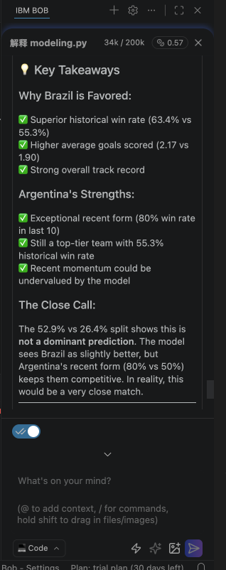
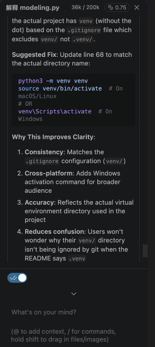

# International Football Match Predictor

IBM SkillsBuild AI Builders Challenge June 2026 prototype for predicting international football match outcomes.

The project follows the official IBM SkillsBuild football lab and turns it into a small, runnable proof of concept: a completed Jupyter notebook, reusable Python training code, a command-line predictor, and a Streamlit demo app.

## What it does

- Loads historical international football results.
- Builds chronological team features from prior matches.
- Trains a Random Forest classifier to predict Team A win, draw, or Team B win.
- Shows win/draw probabilities for any two supported national teams.
- Explains each prediction with the team statistics used by the model.

## Data source

The dataset is the Kaggle International football results dataset used by the official IBM SkillsBuild lab:

- Official lab repo: https://github.com/IBM-SkillsBuild-AI-Builders-Challenge/hands-on-labs
- Lab folder: `02_football_lab_june`
- Dataset: `results.csv`
- Approximate coverage: 49,000 international men's football matches from 1872 to 2026
- Fields: date, home team, away team, score, tournament, city, country, neutral venue

## IBM technology used

This project uses IBM Bob as the IBM AI-supported technology.

IBM Bob was used in the same style as the official lab:

- Generate and explain Python/Jupyter code for the data science workflow.
- Help set up the Python and Jupyter environment.
- Explain feature engineering choices such as win rate, average goals, recent form, and neutral venue.
- Debug import, path, and model-training issues.
- Shape the Streamlit prototype and README so the project is easy to demo.

Example Bob prompts:

```text
Help me set up a Python/Jupyter environment for the IBM SkillsBuild football prediction lab.
Generate Python code to load and explore the international football results dataset.
Explain how to engineer leak-resistant team features from historical match results.
Help me create a Streamlit prototype that predicts match winner probabilities and explains the result.
```

### IBM Bob evidence

IBM Bob was used directly inside the project workspace on June 14, 2026. It inspected the Python files, explained a Brazil vs Argentina prediction, and reviewed the README for clarity.

Bob's suggestions were treated as development assistance rather than accepted automatically. For example, Bob suggested renaming the virtual environment to `venv`, but the working project environment is `.venv` and `.gitignore` already covers both names, so the documented command was kept unchanged after verification.

Prediction explanation generated by IBM Bob:



README review generated by IBM Bob:



## Project structure

```text
.
├── app.py                              # Streamlit prototype
├── data/results.csv                    # Official lab dataset
├── demo/demo_script.md                 # 3-minute video script
├── docs/images/                        # IBM Bob usage evidence
├── models/                             # Generated model artifacts
├── notebooks/corelab.ipynb             # Completed project notebook
├── notebooks/official_corelab_reference.ipynb
├── src/football_predictor/modeling.py  # Feature engineering, training, prediction
├── src/train_model.py                  # Training CLI
├── src/predict.py                      # Prediction CLI
├── requirements.txt
└── SUBMISSION.md
```

## Quick start

Create and activate a virtual environment:

```bash
python3 -m venv .venv
source .venv/bin/activate
python -m pip install --upgrade pip
pip install -r requirements.txt
```

Train the model:

```bash
python src/train_model.py
```

Try a command-line prediction:

```bash
python src/predict.py --team-a Brazil --team-b Argentina --neutral --major
```

Run the prototype:

```bash
streamlit run app.py
```

Open the local URL printed by Streamlit, usually `http://localhost:8501`.

## Jupyter notebook

Start Jupyter Lab:

```bash
jupyter lab
```

Open `notebooks/corelab.ipynb` for the completed workflow. The original official lab notebook is kept as `notebooks/official_corelab_reference.ipynb` for reference.

## Model method

The model starts from matches after 1990 and creates features in chronological order so each row uses only team history available before that match.

Features:

- Team A historical win rate
- Team B historical win rate
- Team A average goals
- Team B average goals
- Team A recent form over the last 10 matches
- Team B recent form over the last 10 matches
- Neutral venue flag
- Major tournament flag

The classifier is a Random Forest trained on matches before 2018 and evaluated on matches from 2018 onward. The app uses the latest full-dataset team summaries for interactive predictions.

## Limitations

This is a proof of concept, not a betting or professional forecasting model. It does not include player injuries, squad selection, Elo ratings, home crowd size, travel fatigue, weather, betting market data, or live team strength. Some team names and historical entities reflect the original dataset.

## Future improvements

- Add Elo or Glicko-style ratings.
- Calibrate probabilities.
- Add tournament-specific models.
- Include squad/player features when available.
- Deploy the Streamlit app publicly.
- Add automated tests for feature engineering and prediction edge cases.

## Challenge submission

See `SUBMISSION.md` for the final challenge checklist and text fields to fill after creating the public GitHub repo and recording the demo video.
